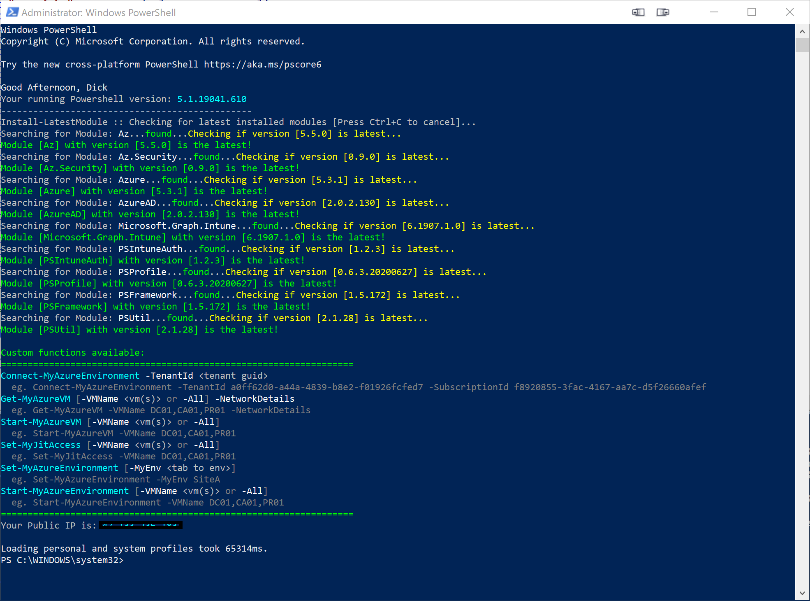
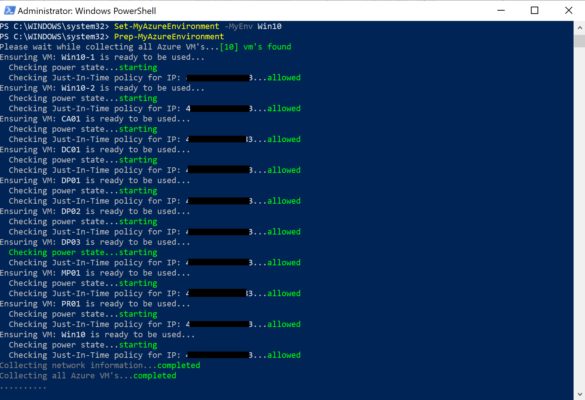
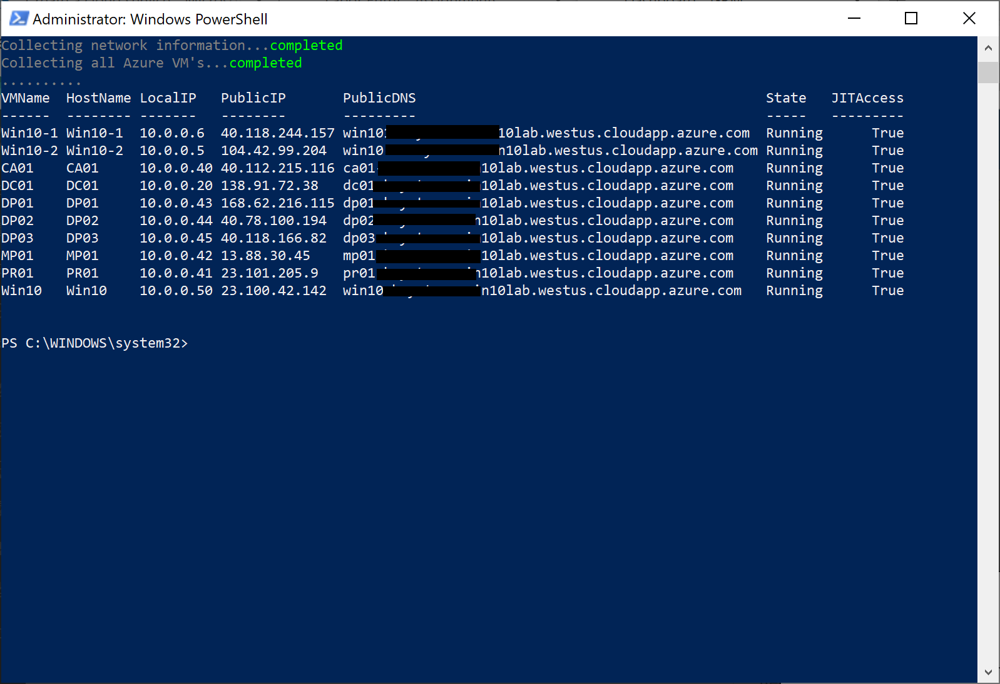

# MyAzureProfileScript
THis is a still a work in progress...ins't everything?

Its a Profile script for your admin system to simply manage VMs in multiple (or singular) Azure tenants. I have multiple tenants and need to start them up based on what I am testing.
## Edit Script
 There are some areas that needs to be modified. Tee very first function, __Set-MyAzureEnvironment__, is where the Azure tenants are configured; add the tenant info to each site.

This script will not be called if its opened in ISE or VScode (its gets pretty annoying in editors)

```powershell
#My Azure Site B lab
'SiteB' { 
            $global:myTenantID = '<your tenant ID>'
            $global:mySubscriptionName = '<your subscription name>'
            $global:mySubscriptionID = '<your subscription ID>'
            $global:myResourceGroup = '<your resource group>'
        }
```
Make sure to update [ValidateSet] in the param section (line 29) as well if you add new site names.

```powershell
[ValidateSet('SiteA','SiteB')]
```

However you can disable it if you set line to 10 to
```powershell
$VoiceWelcomeMessage = $false
```

On line 11, i have the script install multiple modules. You will need to edit those you don't feel you need. I would recommend keeping these (used by this script):

- Az
- Azure
- AzureAD
- Az.Security

## Call the script
Copy this script to your C:\Users\\\<userprofile>\Documents\WindowsPowerShell folder and relaunch Windows PowerShell.
> If you alreafy have a profile script in there, make sure you make a backup or integrate your code into this one.

The only command you will need run are:
 - Set-MyAzureEnvironment
 - Start-MyAzureEnvironment
You will also be presented with a grid output to verify the subscription list. 

Also the first time you connect to Azure using Powershell, an identity file is creating in your profile. And me being a nerd, I parse that file to look for the authenticated username's firstname and output a voice such as: "Good morning Powershelcrack,Please wait while I check for installed modules..."

...I plan on making more voice commands within the functions: NERD!!

## Screenshots
Here are some screen shots, when running the commands







## Functions Included
However there are allot of other functions available in this script:

- Test-IsISE
- Test-VSCode
- Get-VolumeLevel
- Set-VolumeLevel
- Test-IsAdmin
- Elevate-Process
- Out-Voice
- Open-File
- Install-LatestModule
- Connect-MyAzureEnvironment
- Get-MyAzureNSGRules
- Get-MyAzureVM
- Start-MyAzureVM
- Extract-MaxDuration
- Set-MyJitAccess
- Set-MyAzureEnvironment
- Start-MyAzureEnvironment
- Get-MyAzureUserName
- Get-MyHyperVM
- Kill-MyHyperVM
- Restart-MyHyperV
- Show-MyCommands